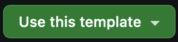

# Clasp Example Project

Google Apps Script is a very useful tool, but when projects become large they can be a nightmare to debug. Clasp provides functionality for linking a folder on your computer to a google Apps Script (GAS) project, so that you can work on the project locally and push any changes you make to your google workspace. This can improve development by enabling a user to write tests for their code (with some caveats) and also use git and gitlab for version control and CI.

This repo intends to be an example of how to set up clasp with a google app scripts project. It is meant to be used as a template (not forked).

### High Level Overview of Clasp

#### Commands

`clasp` is a command line application which exposes simple commands, allowing a user to:

- __login__ to a google account
- __clone__ an Apps Script project onto their computer
- __push__ local changes to google workspace
- __pull__ google workspace changes into their local project folder
- __create__ a new standalone project which can be added to a user's workspace
- __logout__ of a google account

#### The anatomy of a `clasp` project

- `.appscript.json`: Contains information about the Apps Script project, including which _Advanced Services_ are in use (such as BigQuery, etc.). This is shared between the local clasp project and google workspace.
- `.clasp.json`: Contains information about the clasp project, such as the ID of the google workspace project which it is linked to and the root directory where the Apps Script files are located. This file only exists on the user's computer.
- `src/`: It is common to separate source code from other project files. In this example repo, all of the files needed by GAS are located in the `src` folder. This is specified in the `.clasp.json` file.

## Set up `clasp` with an Existing Apps Script project

### Create repository

To create a new repository templated on this one, go to the top right corner of the repository page and click the `Use this template` button, then select `Create a new repository`:



You can then clone this newly created repository onto your machine using `git`.

### Install node

`clasp` is a node module, so you must download and install node.js. If you are using a package manager for windows, linux or macOS, then you can use that to install node, otherwise you can download and install it for any platform [here](https://nodejs.org/en/download). Note that if you are on a non-LTS version of node, you may have to downgrade (if you ever see the error: `punycode is deprecated in npm`, then you definitely need to switch to an LTS version of node).

### Install project dependencies

Once you have installed node, open a terminal in the root project directory and enter the following command:

```bash
npm install
```

This will install `clasp`, `typescript` and a number of other node modules.

### Log into google account using `clasp`

Again, from the terminal in the root directory of your project, run:

```
clasp login
```

This will open a browser and prompt you to log into your google account.

_Note_: after this step is completed, a file containing a token and a user 'secret' will be stored in the home directory of your machine, so please only use `clasp` on your own computer.

### Clone Apps Script project

To import your work from an existing Apps Script project, enter the following command, replacing `apps_script_id` with your GAS project ID. Your project ID can be found located under Project Settings in your google Apps Script workspace.

```bash
clasp clone "apps_script_id" --rootDir "./src"
```

You can also just copy and paste the url of your Apps Script project instead of using the ID.

```bash
clasp clone "https://script.google.com/u/0/home/projects/your_apps_script_id/edit" --rootDir "./src"
```

__Important__: You must move the generated `src/.clasp.json` file into your project's root directory.

### Update file extensions

The files you cloned from your App scripts project will have a `.js` extension. On all your files, change this to `.ts`. Files with a `.ts` extension will be treated as TypeScript files. The software team encourages everyone to use TypeScript wherever they can (instead of JavaScript), as static type checking can help people catch mistakes while they're programming, as opposed to when they run their code.

### Make a change and push

At this point, your local project folder and the Apps Script project are linked via the google project ID stored in `.clasp.json`, so you can make changes to the code locally and then run the following command to push them to google workspace.

```bash
clasp push
```

With TypeScript set up, this will two things:

1. Compile your TypeScript code into pure JavaScript, which Apps Script can understand.
2. Publish your new code to your google Apps Script workspace.

If you have made any changes remotely, you can pull them onto your machine using the following command.

```bash
clasp pull
```

_Note_: this will pull your compiled `.js` files which have been generated from your TypeScript, so there is no point in editing them.

__Important__: `clasp push` will always replace the whole content of the online project. Likewise, `clasp pull` will also overwrite your local `.js` files (without warning). Therefore, making regular `git` commits is highly recommended. That way you can fall back on earlier commits if you make changes which break your code in any way.

## Extras

#### TypeScript Definitions for Advanced Services

If you plan on using any of the advanced services offered by GAS, AND if there are TypeScript defintions available, you can install them with:

```bash
npm install -D @types/google-apps-script-<serice_name>
```

For example, TypeScript definitions are available for OAuth2 and can be installed with:
```bash
npm install -D @types/google-apps-script-oauth2
```

And add the types reference to your `tsconfig.json` file:

```json
{
  "compilerOptions": {
    "lib": ["esnext"],
    "types": ["google-apps-script", "google-apps-script-oauth2"],
    "experimentalDecorators": true,
    "strict": true
  }
}
```

_Note 1_: not all advanced services will have TypeScript type definitions.
_Note 2_: there are some TypeScript limitations outlined [here](https://github.com/google/clasp/blob/master/docs/typescript.md).

### TypeScript Test Setup (optional)

This template repo uses [jest](https://jestjs.io/) for unit testing.

To add tests for your code, you must start by add `export` declarations to any functions and data types which you'd like to write tests for. Apps Script ignores these declarations so they won't affect the functionality of your code at all. You can have a look at the example tests to see how you might go about writing tests for your code.

Start by modifying the existing import statements so that they are importing the functions which you want to test. Then, you can update the tests and test various inputs and outputs for your functions.

The example tests don't even scratch the surface of what you can do with jest. Please refer to the documentation for more examples.
